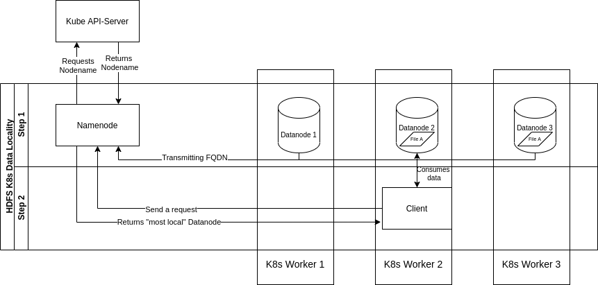

# hdfs-k8s-topology-plugin #

## About ##
The assumption of Data Locality is, that it is more efficient to move the computation rather than to move the data.
The Hadoop Distributed Filesystem (HDFS) runs a lot of Locality-Optimizing code by default, to increase performance and reduce network traffic.
Unfortunatly, the native Hadoop-Data-Locality-Implementation is not compatible with Kubernetes. 
This repository provides a K8s-HDFS-Data-Locality implementation, which fixes this issue regardless of the network-plugin used by Kubernetes.

## The Plugin ##
 \
This diagram demonstrates the K8s-HDFS-Data-Locality-Routine, splitted up in two steps.
### Step 1 ###
When Datanode-Pods are created in the Kubernetes-Cluster, they register themself at the Namenode, on which they are assigned to.
Together with other registration details, the Datanodes are transmitting a Full-Qualified-Domain-Name(FQDN), such as "kubernetes-worker-6.ds.example.local".
The Namenode then uses these FQDNs to build a Networkpath of the form : "/rack/host/PodIP" for each Datanode.
### Step 2 ###
The same procedure is applied, whenever a client sends a request to Namenode. Based on the client-IP, the Namenode constructs a Networkpath in the same form as in case of Datanode-Registry.
After that, Namenode is now able to match clients and Datanodes on the same K8s-Nodes. 
In terms of the example shown in the diagram, this would mean that the client uses "File A" from Datanode 2, instead of same file from Datanode 3.

## The Algorithm ##
### Datanodes ###
In case of Datanodes, the main method of the Plugin receives a FQDN per Datanode.
Because FQDNs are always constructed in such form, that K8s-Nodename is at the beginning and sepreated with a point from other content,
 Namenode simply splits each FQDN at the first point.
### Clients ###
 In case of clients, the main methods of the Plugin receives the IP of the Client Pod.
 The Namenode uses a KubernetesClient to ask the KubeAPI-Server, which Nodename corresponds to the given IP.
 After that, the Namenode looks for any Datanode (with required data) on the same K8s-Node as the client and finally returns a sorted list of Datanodes to the client.
 The Client then connects to the first entry, which represents the "most local" Datanode.
 #### Caching ###
 Because the resolving of clients requires a KubeAPI-query, each resolved Nodename is cached per IP and is deleted after a fixed amount of time.
 By default, this Cache-Expiry-Interval is set to 5 minutes, but you can change this by setting the environment variable ``TOPOLOGY_UPDATE_IN_MIN`` in Namenode-Pod.
 
## Build ##
This project can be built with maven.
Simply run ``mvn clean package`` and use the \<jar-with-dependencies\>.jar for integration.
## Integrate ##
1. Copy the Jar to Namenode-, Namenode-Formatter-, Checkpointnode-, Datanodes-Image in directory: "/opt/hadoop-<version>/share/hadoop/common/lib" 
2. Add following tags to hdfs-siteconfig.xml
    ````xml
    <property>
        <name>net.topology.node.switch.mapping.impl</name>
        <value>org.apache.hadoop.net.PodToNodeMapping</value>
    </property>
    <property>
        <name>net.topology.impl</name>
        <value>org.apache.hadoop.net.NetworkTopologyWithNodeGroup</value>
    </property>
    <property>
        <name>net.topology.nodegroup.aware</name>
        <value>true</value>
    </property>
    <property>
        <name>dfs.block.replicator.classname</name>
        <value>org.apache.hadoop.hdfs.server.blockmanagement.BlockPlacementPolicyWithNodeGroup</value>
    </property>
    ````
3. If you wish to set a Cache-Expiry-Interval other than 5 minutes, you can set a Namenode environment-variable with name ``TOPOLOGY_UPDATE_IN_MIN``
4. The namenode needs a K8s-Serviceaccount with permission to `get` all pods in K8s Cluster

## Test ##
1. Create new HDFS-Client Pod (with DEBUG-log setting)
2. Connect on client Pod and run a ``cat`` (or other read command) on a file stored in HDFS
3. Search for following Log-Message in client logs: 
    ````
   DEBUG DFSClient: Connecting to datanode <datanode-ip>
    ````
4. Check if <datanode-ip> matches IP of the datanode which is located on same kubernetes-node as Client-Pod
5. Repeat this test several times
